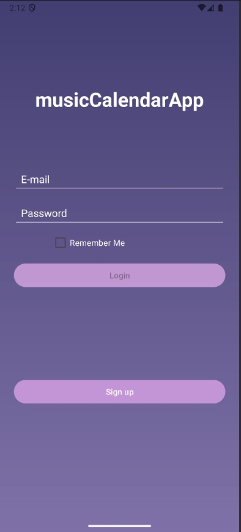
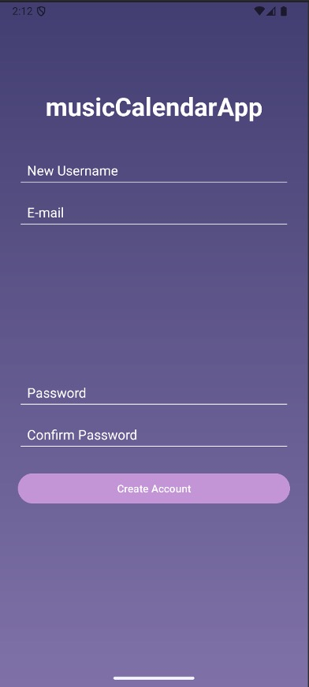
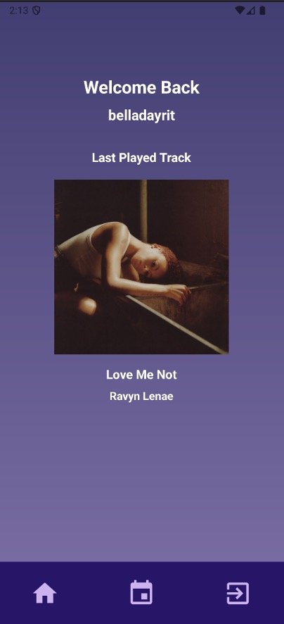
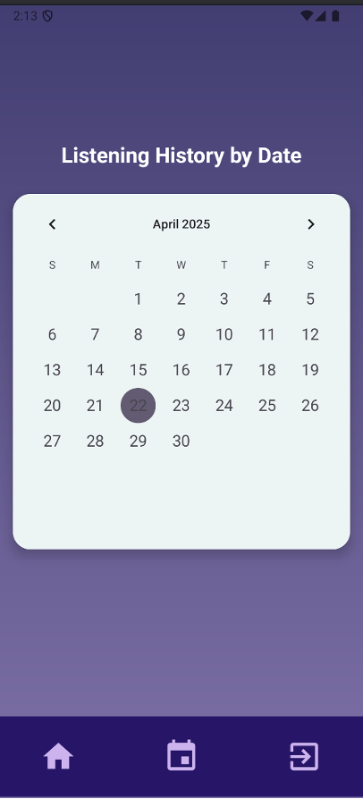
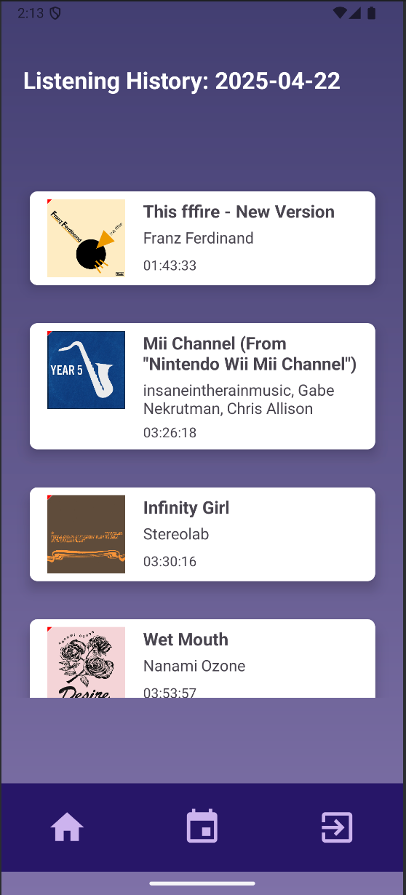
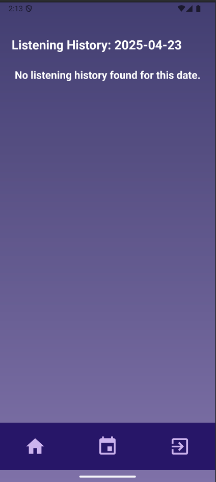

# Android Music Spotify Calendar App

The purpose of this project was to create a mobile Android application that transforms your daily listening habits into a visual calendar. Powered by the Spotify API and Firebase, the app tracks your music playback and lets you explore your listening history day by day — like a musical journal in your pocket.

This is my most recent version of the app as I want to continue working on it to add more features to develop the application even further. I used Android SDK, Firebase Realtime DB, Firebase Cloud Functions, and Spotify's Web API to create this project. Eventually, I'd like to transition this app's idea to React-Native so it could be supported on both Android and iOS

# Current Application's UI

*This is the login screen and sign up page. They represent the first activity that's shown when you're opening the app*

*The image on the right is the home page and is what you seen when you login. The most recent track dynamically updates to whatever the user is currently playing on their Spotify account regardless of what device they're playing on*

*This represents what the user sees when they click on a specific day to view their listening history. This is dynamically updated as the app is launched and the user is listening on Spotify. These are both scrollable views*

# Links to Demo Videos
These are links to demo videos that are hosted in Google Drive, showing the app's functionality in action.

[Populated User Demo Video](https://drive.google.com/file/d/14wilNhpJXqkkTW0ihJ3m7QICJO1Bk6Bj/view?usp=sharing)

[New User Signup Demo Video](https://drive.google.com/file/d/1W6wOf6cP52RfQhrS8M3YGS9Bk8_FWbPT/view?usp=drive_link)

[Spanish Support Demo Video](https://drive.google.com/file/d/1_sNqL7CD9VBu9moRZcCvI-XIddwgHoSe/view?usp=drive_link)
